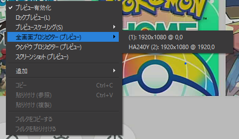
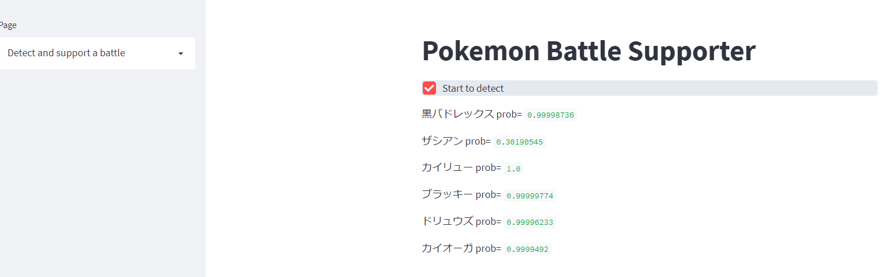
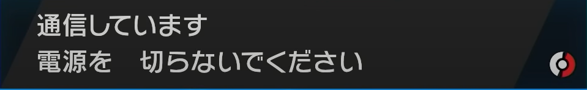

# pokemon_battle_analysis
ポケモン剣盾の対戦画面を自動的に読み込み、相手の構築を検出、保存し、且つ随時画面に出力するようなツール（を組みたい。）
streamlitを使ってローカル上であればウェブアプリのように使うことが出来る。

現時点で勝敗判定が出来ていないので、次はそこら辺をやりたい。

# Usage
- pipでrequirements.txtに書いてあるライブラリをインストールする
```
pip install -r requirements.txt
```
とかで良いと思われる。

- 
```
cd xxx/pokemon_battle_analysis
```
でルートディレクトリに移動して、
```
streamlit run src/app.py
```
でアプリを起動する。

- OBSなどのソフトを用いて、ポケモンのゲーム画面が全画面に移るようにする。（OBSであれば、画面上で右クリック⇒全科目プロジェクター（プレビュー）で行けるはず）
この時、複数モニタがある場合はセカンドモニタにゲーム画面が移るようにするとよいかも。


- 左のサイドバーで複数ページ選択できるが、基本はDetect and support a battleで良い。
"Start to detect"ボタンを押すと画面認識が始まるので、ゲームの方で対戦を始めよう。

対戦画面左上の"Select Time"の画像で認識しているので、選出場面になってもアプリが動かない場合はSelect timeの画像を取り直そう⇒次章で解説


- 上手く分類が出来ていれば、

のような画面が表示される。また、相手の構築に関する記録はresource/battle_result配下のbattle_result.csvに保存される。

## 対戦開始が上手く認識されない場合
アプリ側に対戦開始/終了の合図となる画面を教える必要がある。
（恐らく環境が異なると、最初は上手く認識されないのが殆どだと思われる。）

方法：
- の画面が映っている時に
```
python src\make_train_data\make_SelectTime_fig.py
```
をコマンドライン上で打ち込む。選出時間は１分半あるので、落ち着いて打ち込もう。

同様に、対戦終了の画面は
が映っている時に
```
python src\make_train_data\make_FinishBattle_fig.py
```
を打ち込もう。此方は猶予が数秒しかないので、降参などをしてタイミングを合わせるのが良い。

## その他の機能
